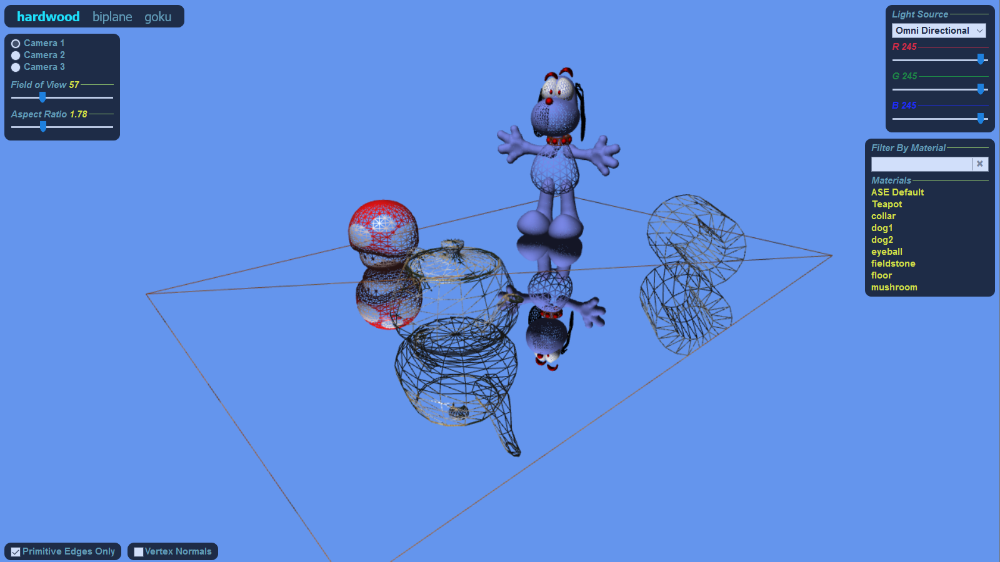
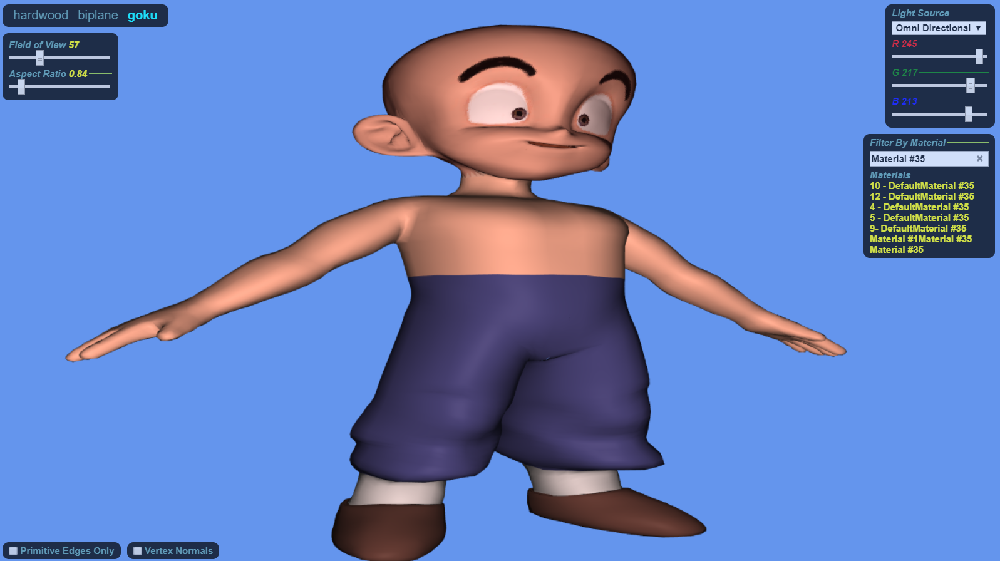

# Direct3D to WebGL
I wrote a Direct3D 9 demo way back in 2004 using Visual Studio .NET 2002 for Windows XP. The demo featured a basic scene graph and several advanced HLSL shaders for that time period (bump mappping and Phong shading). In addition, I also added translucent objects and made use of the stencil buffer to model a reflective hardwood floor. The demo displays several interesting objects and allows the camera to be repositioned by dragging the mouse around. The various light sources can also be adjusted via a modeless dialog box.

Fast-forward to 2017, I wanted to get this demo running on a modern day web browser, which would require experimenting with several web technologies including HTML5, CSS, Javascript, WebGL, React and Redux. A primary goal was to ditch the need to have to build a version for each flavor of desktop operating system e.g. Windows, MacOS and Linux.

However, before doing all this I discovered I could no longer build the original C++ source code on Windows 10. The DirectX 9 SDK has been relegated to the annals of history so it seems so I upgraded the code to Direct3D 11 using Visual Studio 2015. This allowed close study of a running instance of the demo at the source level. Along the way I took advantage of some modern day conveniences like C++11, git LFS and gitHub, which didn't exist back then.

Ultimately, the port to WebGL was successful and I learnt a lot of cool stuff about web development along the way.

## Getting Up and Running

The easiest way to view the app is to visit [https://d3d-to-webgl.orky.net](https://d3d-to-webgl.orky.net). Or, you can use **node.js**, v12.x or higher, to serve the content from your own computer.

After cloning the repo, in a command shell, **cd** into the **d3d-to-webgl/webgl** folder and type **npm install** [enter] to resolve all package dependencies. Then type **npm start** [enter] to boot up a local web server that will serve the content. The single page application can then be viewed in a browser at **localhost:3000**. The content has been tested on several browsers including Firefox, Safari and Google Chrome.

